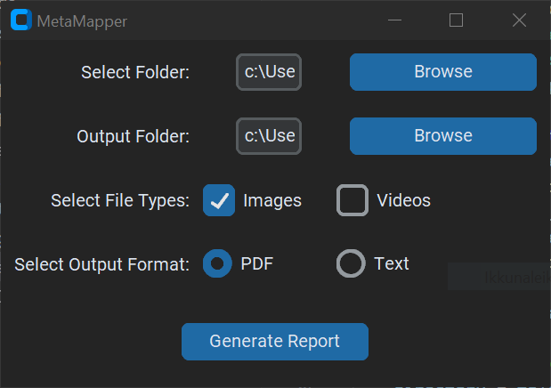

# MetaMapper

MetaMapper is a lightweight script designed to extract and organize EXIF data from images and videos.

## Features

- Extract EXIF data from multiple images and videos in a selected folder
- Generate reports in PDF or text format
- User-friendly interface

## Installation

1. **Clone the repository:**

    ```sh
    git clone https://github.com/pteras/MetaMapper.git
    cd MetaMapper
    ```

2. **Install the required dependencies:**

    ```sh
    pip install -r requirements.txt
    ```

3. **Run the application:**

    ```sh
    python metamapper.py
    ```

## Requirements

- Python 3.x
- `Pillow` for image processing
- `hachoir` for video metadata extraction
- `FPDF` for PDF report generation
- `tkinter` for the graphical user interface

## Screenshots



## Contributing

Please fork this repository and submit a pull request with your improvements.

## License

This project is licensed under the MIT License. See the [LICENSE](LICENSE) file for details.

## Acknowledgments

- [Pillow](https://python-pillow.org/)
- [hachoir](https://github.com/vstinner/hachoir)
- [FPDF](http://www.fpdf.org/)
- [customtkinter](https://github.com/TomSchimansky/CustomTkinter)

---

This has been a study project during my exchange.
If you have any questions, let me know.
